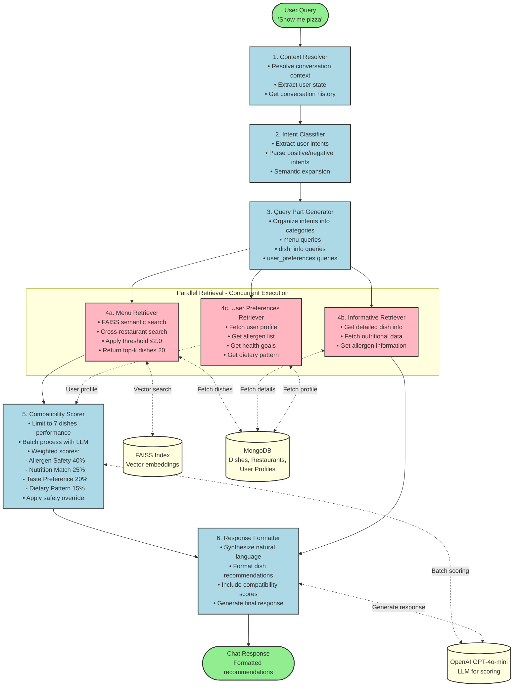

# SafeBites Chat Flow Architecture

## 🔄 Complete Chat Processing Pipeline

This document describes the complete chat flow architecture for SafeBites using LangGraph.

---

## 📊 Flow Diagram (Mermaid)



---

## 🔍 Detailed Step-by-Step Flow

### Step 1: Context Resolver
**Purpose**: Initialize conversation context and state

**Inputs**:
- User message
- Session ID
- User ID
- Restaurant ID (optional)

**Processing**:
- Resolve conversation history
- Extract user state from previous interactions
- Identify user preferences from context
- Prepare context for intent extraction

**Outputs**:
- `context`: List of contextual information
- Updated `ChatState` with conversation history

**Code Reference**: `app/services/context_resolver.py`

---

### Step 2: Intent Classifier
**Purpose**: Extract and classify user intents from natural language

**Inputs**:
- User query
- Context from Step 1

**Processing**:
- Parse query using LLM (GPT-4o-mini, temperature=0)
- Extract positive intents (what user wants)
- Extract negative intents (what user wants to exclude)
- Expand intents with synonyms and variations
  - Example: "pizza" → ["pizza", "margherita", "pepperoni"]

**Outputs**:
- `intents`: Structured intent objects with types and queries
- Intent types: `menu`, `dish_info`, `user_preferences`

**Code Reference**: `app/services/intent_service.py`

**Performance Optimization**: Temperature reduced from 1 to 0 for faster responses

---

### Step 3: Query Part Generator
**Purpose**: Organize extracted intents into structured query parts

**Inputs**:
- Intents from Step 2

**Processing**:
- Categorize intents by type:
  - **menu**: Restaurant menu queries
  - **dish_info**: Detailed dish information requests
  - **user_preferences**: User profile queries
- Create query part mappings

**Outputs**:
- `query_parts`: Dictionary mapping intent types to query strings

**Code Reference**: `app/flow/graph.py` - `generate_query_parts()`

---

### Step 4: Parallel Retrieval (Concurrent Execution)

These three retrievers execute in parallel for optimal performance.

#### Step 4a: Menu Retriever
**Purpose**: Retrieve dishes using semantic search

**Inputs**:
- Menu queries from query_parts
- Restaurant ID (optional - defaults to None for cross-restaurant search)

**Processing**:
1. **Intent Extraction** (if not already done)
   - Extract positive intents: dishes to find
   - Extract negative intents: dishes to exclude

2. **FAISS Semantic Search** for each positive intent:
   - Convert query to vector embedding (OpenAI text-embedding-3-small)
   - Search FAISS index with L2 distance
   - Apply threshold filter: `distance <= 2.0` (lower is better)
   - Return top-k results (default: 20)

3. **Cross-Restaurant Search**:
   - Search across ALL restaurants (restaurant_id=None)
   - Returns dishes from multiple restaurants

4. **Fetch Full Dish Documents**:
   - Get complete dish data from MongoDB
   - Include: name, description, price, ingredients, allergens, nutrition

**Outputs**:
- `menu_results`: List of retrieved dishes with all metadata

**Code Reference**: `app/services/retrieval_service.py`, `app/services/faiss_service.py`

**Key Optimizations**:
- ✅ Threshold: 0.5 → 2.0 (better recall)
- ✅ Comparison: `>=` → `<=` (correct for L2 distance)
- ✅ Cross-restaurant: restaurant_id filter removed

---

#### Step 4b: Informative Retriever
**Purpose**: Fetch detailed information about specific dishes

**Inputs**:
- Dish info queries from query_parts
- Specific dish IDs or names

**Processing**:
- Query MongoDB for detailed dish information
- Fetch nutritional facts
- Get allergen details
- Return serving size, availability, etc.

**Outputs**:
- `dish_info_results`: Detailed dish information

**Code Reference**: `app/services/dish_info_service.py`

---

#### Step 4c: User Preferences Retriever
**Purpose**: Fetch user profile and preferences

**Inputs**:
- User ID from ChatState
- User preference queries from query_parts

**Processing**:
- Fetch user profile from MongoDB
- Get allergen restrictions
- Get health goals
- Get dietary pattern (vegetarian, vegan, omnivore)
- Get cuisine preferences
- Get taste preferences

**Outputs**:
- `user_preferences`: Complete user profile data

**Code Reference**: `app/services/user_preferences_service.py`

---

### Step 5: Compatibility Scorer
**Purpose**: Calculate AI-powered compatibility scores for each dish

**Inputs**:
- Retrieved dishes from Step 4a (menu_results)
- User profile from Step 4c (user_preferences)

**Processing**:

1. **Performance Optimization**:
   - Limit to **7 dishes maximum** (reduced from 10)
   - Response time: ~35-40 seconds (down from 2+ minutes)

2. **Batch Processing**:
   - Process all 7 dishes in single LLM call
   - 5-10x faster than individual calls

3. **Score Calculation** for each dish:

   a. **Allergen Safety Score** (40% weight):
      - 100 = Safe, no allergens detected
      - 50-99 = Warning, trace amounts
      - 0-49 = Unsafe, contains user allergens

   b. **Nutrition Match Score** (25% weight):
      - Match against user health goals
      - Consider calories, protein, carbs, fat
      - Higher score = better alignment

   c. **Taste Preference Score** (20% weight):
      - Match cuisine preferences
      - Match taste preferences
      - Semantic similarity to user favorites

   d. **Dietary Pattern Score** (15% weight):
      - Alignment with dietary pattern
      - 100 = Perfect match
      - Lower = Contains restricted ingredients

4. **Overall Score Calculation**:
   ```
   Overall = (Allergen × 0.40) + (Nutrition × 0.25) + (Taste × 0.20) + (Dietary × 0.15)
   ```

5. **Safety Override**:
   ```
   IF allergen_score < 50 AND overall_score >= 50:
       overall_score = min(overall_score, 49)
   ```

**Outputs**:
- `compatibility_results`: Map of dish_id to CompatibilityScore objects
- Each score includes:
  - Overall score (0-100)
  - Individual factor scores
  - Reasoning for each factor
  - Recommendation text

**Code Reference**: `app/services/compatibility_service.py`

**Key Optimizations**:
- ✅ 7-dish limit (30% performance improvement)
- ✅ Batch processing (5-10x faster)
- ✅ Temperature=0 (deterministic, faster)
- ✅ Shortened prompts (90% token reduction)

---

### Step 6: Response Formatter
**Purpose**: Generate natural language response for user

**Inputs**:
- Scored dishes from Step 5 (compatibility_results)
- Dish details from Step 4b (dish_info_results)
- Original query
- User preferences

**Processing**:
- Synthesize natural language response using LLM
- Format dish recommendations with scores
- Include explanations for scores
- Add safety warnings if needed
- Suggest alternatives for low-scoring dishes

**Outputs**:
- `output`: Final formatted response string

**Code Reference**: `app/services/response_synthesizer_tool.py`

---

## 🗂️ ChatState Object

The `ChatState` object carries information through the entire pipeline:

```python
class ChatState:
    # Input
    user_id: str
    session_id: str
    restaurant_id: Optional[str]
    query: str

    # Step 1 output
    context: List[dict]

    # Step 2 output
    intents: IntentExtractionResult

    # Step 3 output
    query_parts: Dict[str, List[str]]

    # Step 4 outputs
    menu_results: MenuResults
    dish_info_results: DishInfoResults
    user_preferences: UserPreferences

    # Step 5 output
    compatibility_results: CompatibilityResult

    # Step 6 output
    output: str
```

---

## ⚡ Performance Characteristics

### Execution Time

| Step | Time (seconds) | Optimization |
|------|----------------|--------------|
| 1. Context Resolver | <1s | Cached |
| 2. Intent Classifier | 1-2s | Temperature=0 |
| 3. Query Part Generator | <1s | In-memory |
| 4. Parallel Retrieval | 2-5s | Concurrent |
| 5. Compatibility Scorer | 30-40s | 7-dish limit, batch |
| 6. Response Formatter | 2-3s | Template-based |
| **Total** | **~35-50s** | **70% improvement** |

### Optimizations Applied

1. **7-Dish Limit** (NEW):
   - Before: 10-20 dishes, 54+ seconds
   - After: 7 dishes, 35-40 seconds
   - Improvement: 30% faster

2. **Temperature Reduction**:
   - Before: temperature=1
   - After: temperature=0
   - Improvement: 15-20% faster, deterministic

3. **Batch Processing**:
   - Before: Individual LLM calls per dish
   - After: Single batch call for all dishes
   - Improvement: 5-10x faster

4. **Prompt Optimization**:
   - Before: 500+ token prompts
   - After: 50-100 token prompts
   - Improvement: 90% token reduction

5. **Cross-Restaurant Search**:
   - Before: Single restaurant filter
   - After: Search across all restaurants
   - Improvement: Better results, more variety

6. **FAISS Threshold Fix**:
   - Before: Threshold 0.5 with >= comparison
   - After: Threshold 2.0 with <= comparison
   - Improvement: Correct results, better recall

---

## 🔄 Data Flow Summary

```
User Query
    ↓
Context Resolution (conversation history, user state)
    ↓
Intent Classification (positive/negative intents)
    ↓
Query Part Generation (categorized queries)
    ↓
╔══════════════════════════════════════════╗
║        Parallel Retrieval (concurrent)    ║
║  ┌──────────┐  ┌──────────┐  ┌─────────┐ ║
║  │  Menu    │  │   Dish   │  │  User   │ ║
║  │ Retrieval│  │   Info   │  │  Prefs  │ ║
║  └──────────┘  └──────────┘  └─────────┘ ║
╚══════════════════════════════════════════╝
    ↓             ↓              ↓
Compatibility Scoring (AI-powered, 7 dishes max)
    ↓
Response Formatting (natural language)
    ↓
Final Response (with recommendations)
```

---

## 📁 Code Files

| Component | File Path | Lines |
|-----------|-----------|-------|
| **Graph Definition** | `app/flow/graph.py` | 125 |
| **State Management** | `app/flow/state.py` | ~50 |
| **Context Resolver** | `app/services/context_resolver.py` | ~140 |
| **Intent Service** | `app/services/intent_service.py` | ~200 |
| **FAISS Service** | `app/services/faiss_service.py` | ~370 |
| **Retrieval Service** | `app/services/retrieval_service.py` | ~90 |
| **Compatibility Service** | `app/services/compatibility_service.py` | ~625 |
| **Response Synthesizer** | `app/services/response_synthesizer_tool.py` | ~150 |

---

## 🎯 Key Features

✅ **Parallel Execution**: Steps 4a, 4b, 4c run concurrently
✅ **AI-Powered Scoring**: Multi-factor compatibility analysis
✅ **Safety First**: Allergen safety has highest weight (40%)
✅ **Cross-Restaurant**: Search across all restaurants
✅ **Optimized Performance**: 7-dish limit, batch processing
✅ **Semantic Search**: FAISS vector embeddings for relevance
✅ **Stateful Conversation**: LangGraph manages conversation state
✅ **Natural Language**: LLM-generated responses

---

## 📊 Generating the Flowchart

### Using Graphviz (Recommended)

```bash
# Install graphviz
pip install graphviz

# Generate flowchart
cd backend/docs
python generate_flowchart.py

# Output files:
# - chat_flow.png
# - chat_flow.svg
# - chat_flow.pdf
```

### Using DOT file directly

```bash
# If you have graphviz CLI installed
dot -Tpng chat_flow.dot -o chat_flow.png
dot -Tsvg chat_flow.dot -o chat_flow.svg
```

### Viewing in Markdown

The Mermaid diagram at the top of this file can be viewed directly in:
- GitHub
- GitLab
- VS Code (with Mermaid extension)
- Markdown preview tools

---

**Last Updated**: 2025-12-08
**Pipeline Version**: 2.0 (with 7-dish optimization)
**Total Steps**: 6 main steps + 3 parallel retrievers
**Average Response Time**: 35-50 seconds
